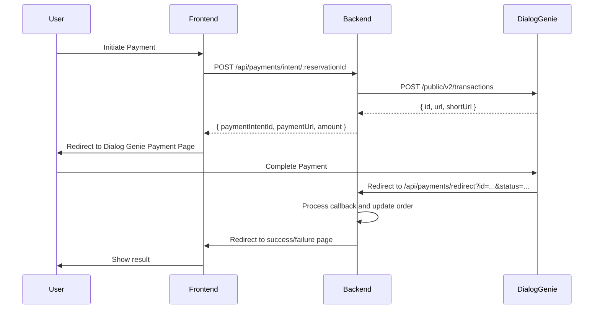

# Dialog Genie Payment Gateway Integration Guide

This document provides a comprehensive guide for integrating Dialog Genie Payment Gateway (powered by Dialog Sri Lanka) into your project. It covers the complete payment flow, API endpoints, request/response structures, and implementation patterns.

---

## Table of Contents

1. [Overview](#overview)
2. [Environment Configuration](#environment-configuration)
3. [Payment Flow Architecture](#payment-flow-architecture)
4. [API Endpoints](#api-endpoints)
5. [DTOs and Data Structures](#dtos-and-data-structures)
6. [Implementation Guide](#implementation-guide)
7. [Handling Callbacks and Redirects](#handling-callbacks-and-redirects)
8. [Transaction Status Verification](#transaction-status-verification)
9. [Error Handling](#error-handling)
10. [Security Considerations](#security-considerations)

---

## Overview

Dialog Genie is a payment gateway service provided by Dialog Axiata PLC, Sri Lanka. It allows merchants to accept online payments through various payment methods including cards and mobile wallets.

### Key Features
- **Simple REST API integration**
- **Redirect-based payment flow**
- **Callback notifications for payment status**
- **Support for LKR currency**
- **UAT (sandbox) and Production environments**

---

## Environment Configuration

Add the following environment variables to your `.env` or configuration file:

```env
# Dialog Genie Payment Gateway Configuration

# API URL - Use UAT for testing, production URL for live
DIALOG_GENIE_API_URL=https://api.uat.geniebiz.lk/public/v2/transactions

# API Key - JWT token provided by Dialog Genie
DIALOG_GENIE_API_KEY=your_jwt_api_key_here

# Payment URL - Base URL for payment page (merchant-specific)
DIALOG_GENIE_PAYMENT_URL=https://transaction.uat.geniebiz.lk/your_merchant_id

# Your server's public URL for callbacks (use ngrok for local development)
NGROK_URL=https://your-server-url.com

# Frontend URL for redirects after payment
FRONTEND_URL=http://localhost:3001
```

### Production vs UAT Environment

| Environment | API URL |
|-------------|---------|
| UAT (Sandbox) | `https://api.uat.geniebiz.lk/public/v2/transactions` |
| Production | `https://api.geniebiz.lk/public/v2/transactions` |

---

## Payment Flow Architecture



### Flow Steps

1. **Payment Intent Creation**: Backend creates a transaction with Dialog Genie API
2. **User Redirect**: Frontend redirects user to Dialog Genie payment page
3. **Payment Processing**: User completes payment on Dialog Genie interface
4. **Callback/Redirect**: Dialog Genie redirects back to your server with payment result
5. **Order Confirmation**: Backend updates order status and redirects to frontend

---

## API Endpoints

### 1. Create Payment Intent

**Endpoint**: `POST /api/payments/intent/:reservationId`

**Purpose**: Create a payment transaction with Dialog Genie and get payment URL

**Request Body**:
```json
{
  "customer": {
    "name": "John Doe",
    "email": "john@example.com",
    "phoneNumber": "+94771234567",
    "billingEmail": "john@example.com",
    "billingAddress1": "123 Main Street",
    "billingCity": "Colombo",
    "billingCountry": "Sri Lanka",
    "billingPostCode": "00100"
  }
}
```

**Response**:
```json
{
  "paymentIntentId": "transaction_id_from_dialog",
  "paymentUrl": "https://transaction.uat.geniebiz.lk/...",
  "amount": 1000.00
}
```

---

### 2. Payment Redirect Handler

**Endpoint**: `GET /api/payments/redirect`

**Purpose**: Handle redirect from Dialog Genie after payment

**Query Parameters** (sent by Dialog Genie):
- `id` / `transactionId` / `paymentId`: Transaction identifier
- `status`: Payment status (`SUCCESS` or `FAILED`)
- `localId`: Your reservation/order ID (sent in original request)

**Response**: HTTP redirect to frontend success or failure page

---

### 3. Payment Callback (Webhook)

**Endpoint**: `POST /api/payments/callback`

**Purpose**: Receive payment status updates from Dialog Genie

**Request Body**:
```json
{
  "paymentId": "transaction_id",
  "status": "SUCCESS" | "FAILED"
}
```

---

### 4. Check and Confirm Booking

**Endpoint**: `GET /api/payments/check-and-confirm/:reservationId`

**Purpose**: Manually check transaction status and confirm booking

**Query Parameters**:
- `paymentId` (optional): Payment ID to verify

---

## DTOs and Data Structures

### Customer Information DTO

```typescript
export class DialogGenieCustomerDto {
  name: string;           // Customer name
  email: string;          // Customer email (for receipt)
  phoneNumber: string;    // Customer phone number
  billingEmail?: string;  // Billing email (optional, defaults to email)
  billingAddress1?: string;
  billingCity?: string;
  billingCountry?: string;  // Defaults to 'Sri Lanka'
  billingPostCode?: string;
}
```

### Payment Intent Request DTO

```typescript
export class CreateDialogGeniePaymentDto {
  customer?: DialogGenieCustomerDto;
}
```

### Dialog Genie API Request Payload

```typescript
interface DialogGeniePayload {
  amount: number;          // Amount in cents (e.g., 100 = 1.00 LKR)
  localId: string;         // Your reference ID (will be returned in callback)
  currency: 'LKR';         // Currency code
  redirectUrl?: string;    // URL to redirect after payment
  customer?: {
    name?: string;
    email?: string;
    billingEmail?: string;
    billingAddress1?: string;
    billingCity?: string;
    billingCountry?: string;
    billingPostCode?: string;
  };
}
```

### Dialog Genie API Response

```typescript
interface DialogGenieResponse {
  id: string;              // Dialog Genie transaction ID
  url?: string;            // Full payment URL
  shortUrl?: string;       // Short payment URL
}
```

---

## Implementation Guide

### Step 1: Configure Environment

```typescript
// config/app.config.ts
export default () => ({
  dialogGenie: {
    apiUrl: process.env.DIALOG_GENIE_API_URL,
    apiKey: process.env.DIALOG_GENIE_API_KEY,
    paymentUrl: process.env.DIALOG_GENIE_PAYMENT_URL,
  },
  ngrokUrl: process.env.NGROK_URL,
  frontendUrl: process.env.FRONTEND_URL,
});
```

### Step 2: Create Payment Intent

```typescript
async createPaymentIntent(reservationId: string, customerInfo?: CustomerDto) {
  // 1. Validate order exists and is in pending state
  const order = await this.orderModel.findById(reservationId);
  if (!order || order.status !== 'PENDING') {
    throw new BadRequestException('Invalid order');
  }

  // 2. Get Dialog Genie configuration
  const dialogGenieApiUrl = this.configService.get('DIALOG_GENIE_API_URL');
  const dialogGenieApiKey = this.configService.get('DIALOG_GENIE_API_KEY');
  const ngrokUrl = this.configService.get('NGROK_URL');

  // 3. Prepare payload
  // IMPORTANT: Amount should be in cents (multiply by 100)
  const amountInCents = Math.round(order.totalPrice * 100);
  
  const payload = {
    amount: amountInCents,
    localId: reservationId,  // CRITICAL: This is returned in callback
    currency: 'LKR',
    redirectUrl: `${ngrokUrl}/api/payments/redirect`,
    customer: customerInfo ? {
      name: customerInfo.name,
      email: customerInfo.email,
      billingEmail: customerInfo.billingEmail || customerInfo.email,
      billingAddress1: customerInfo.billingAddress1,
      billingCity: customerInfo.billingCity,
      billingCountry: customerInfo.billingCountry || 'Sri Lanka',
      billingPostCode: customerInfo.billingPostCode,
    } : {
      // Default customer info
      name: 'Customer',
      email: 'customer@example.com',
      billingEmail: 'customer@example.com',
      billingCountry: 'Sri Lanka',
    },
  };

  // 4. Call Dialog Genie API
  const headers = {
    'Content-Type': 'application/json',
    'Accept': 'application/json',
    'Authorization': dialogGenieApiKey.trim(),  // No 'Bearer' prefix
  };

  try {
    const response = await axios.post(dialogGenieApiUrl, payload, {
      headers,
      timeout: 30000,
    });

    const paymentUrl = response.data.url || response.data.shortUrl;
    const transactionId = response.data.id;

    if (!paymentUrl) {
      throw new BadRequestException('Payment URL not received');
    }

    // 5. Update order with payment intent ID
    order.paymentIntentId = transactionId;
    order.paymentState = 'PROCESSING';
    await order.save();

    return {
      paymentIntentId: transactionId,
      paymentUrl,
      amount: order.totalPrice,
    };

  } catch (error) {
    // Handle errors (see Error Handling section)
    throw new BadRequestException(`Payment failed: ${error.message}`);
  }
}
```

### Step 3: Handle Payment Redirect

```typescript
async handleDialogGenieRedirect(query: any, res: Response) {
  // Extract payment info from query parameters
  const paymentId = query.id || query.transactionId || query.paymentId;
  const status = query.status || 
    (query.success === 'true' ? 'SUCCESS' : 
    (query.success === 'false' ? 'FAILED' : 'SUCCESS'));
  const localId = query.localId || query.reservationId;

  // Find order
  let order = null;
  if (localId) {
    order = await this.orderModel.findById(localId);
  }
  if (!order && paymentId) {
    order = await this.orderModel.findOne({ paymentIntentId: paymentId });
  }

  if (!order) {
    return res.redirect(`${this.frontendUrl}/error?message=Order not found`);
  }

  // Process payment result
  if (status === 'SUCCESS') {
    order.paymentState = 'SUCCESS';
    order.dialogPaymentId = paymentId;
    await order.save();
    
    // Perform post-payment actions (send confirmation, etc.)
    await this.processSuccessfulPayment(order);
    
    return res.redirect(`${this.frontendUrl}/orders/${order._id}/success`);
  } else {
    order.paymentState = 'FAILED';
    await order.save();
    
    return res.redirect(`${this.frontendUrl}/orders/${order._id}?payment=failed`);
  }
}
```

### Step 4: Handle Payment Callback (Webhook)

```typescript
async handleDialogGenieCallback(callbackData: {
  paymentId: string;
  status: 'SUCCESS' | 'FAILED';
}) {
  const order = await this.orderModel.findOne({
    paymentIntentId: callbackData.paymentId,
  });

  if (!order) {
    throw new NotFoundException('Order not found');
  }

  if (callbackData.status === 'SUCCESS') {
    order.paymentState = 'SUCCESS';
    order.dialogPaymentId = callbackData.paymentId;
    await order.save();
    
    // Perform post-payment actions
    await this.processSuccessfulPayment(order);
    
    return { success: true, orderId: order._id };
  } else {
    order.paymentState = 'FAILED';
    await order.save();
    
    return { success: false, orderId: order._id };
  }
}
```

---

## Handling Callbacks and Redirects

### Redirect Parameters from Dialog Genie

Dialog Genie may send different parameter names. Handle all possible variations:

```typescript
// Payment ID variations
const paymentId = query.id || 
                  query.transactionId || 
                  query.paymentId || 
                  query.transactionReference;

// Status variations
const status = query.status || 
               (query.success === 'true' || query.success === true ? 'SUCCESS' : 
               (query.success === 'false' || query.success === false ? 'FAILED' : 'SUCCESS'));

// Your reference ID
const localId = query.localId || query.reservationId;
```

### Setting Up Redirect URL

```typescript
// Construct redirect URL during payment intent creation
const ngrokUrl = process.env.NGROK_URL;
const redirectUrl = `${ngrokUrl.replace(/\/$/, '')}/api/payments/redirect`;

// Add to payload
payload.redirectUrl = redirectUrl;
```

> **Note**: For local development, use ngrok or similar tunneling service to expose your local server to the internet.

---

## Transaction Status Verification

### Check Transaction Status Manually

```typescript
async checkTransactionStatus(paymentId: string) {
  const dialogGenieApiUrl = this.configService.get('DIALOG_GENIE_API_URL');
  const dialogGenieApiKey = this.configService.get('DIALOG_GENIE_API_KEY');

  const statusUrl = `${dialogGenieApiUrl}/${paymentId}`;
  
  const response = await axios.get(statusUrl, {
    headers: {
      'Authorization': `Bearer ${dialogGenieApiKey}`,
      'Content-Type': 'application/json',
    },
  });

  const status = response.data?.status || response.data?.transactionStatus;
  return {
    paymentId,
    status,
    isSuccess: status === 'SUCCESS' || status === 'COMPLETED',
  };
}
```

---

## Error Handling

### Common Error Scenarios

```typescript
try {
  const response = await axios.post(dialogGenieApiUrl, payload, { headers });
  // Success handling
} catch (error) {
  if (error.response) {
    const { status, data } = error.response;
    const errorMessage = data?.message || data?.error || error.message;
    
    switch (status) {
      case 400:
        throw new BadRequestException(`Invalid request: ${errorMessage}`);
      case 401:
        throw new UnauthorizedException('Invalid API key');
      case 403:
        throw new ForbiddenException(
          'API key lacks required permissions. Contact Dialog Genie support.'
        );
      case 404:
        throw new NotFoundException('Transaction not found');
      case 500:
        throw new InternalServerErrorException('Dialog Genie server error');
      default:
        throw new BadRequestException(`Payment error: ${errorMessage}`);
    }
  } else if (error.request) {
    throw new BadRequestException('Failed to connect to Dialog Genie API');
  } else {
    throw new BadRequestException(`Request error: ${error.message}`);
  }
}
```

### API Key Validation

```typescript
// Validate API key before making requests
const apiKey = this.configService.get('DIALOG_GENIE_API_KEY');

if (!apiKey) {
  throw new BadRequestException('Dialog Genie API key is not configured');
}

const trimmedApiKey = apiKey.trim();
if (trimmedApiKey === '' || trimmedApiKey === 'your_api_key_here') {
  throw new BadRequestException('Invalid API key. Please configure a valid key.');
}
```

---

## Security Considerations

### 1. API Key Storage
- Store API key in environment variables, never in code
- Use secrets management in production (AWS Secrets Manager, HashiCorp Vault, etc.)

### 2. Amount Validation
```typescript
// Always calculate amount server-side
const serverCalculatedAmount = order.items.reduce(
  (sum, item) => sum + item.price * item.quantity, 0
);

// Never trust client-provided amounts
```

### 3. Callback Verification
```typescript
// Verify the payment status with Dialog Genie API
async verifyPaymentCallback(paymentId: string) {
  const status = await this.checkTransactionStatus(paymentId);
  if (!status.isSuccess) {
    throw new BadRequestException('Payment verification failed');
  }
}
```

### 4. HTTPS Required
- Always use HTTPS for production
- Dialog Genie will only call HTTPS endpoints for callbacks

### 5. Idempotency
```typescript
// Handle duplicate callbacks
if (order.paymentState === 'SUCCESS') {
  // Already processed, return success without reprocessing
  return { success: true, message: 'Already processed' };
}
```

---

## Controller Implementation

```typescript
import { Controller, Post, Get, Body, Param, Query, Res } from '@nestjs/common';
import { ApiTags, ApiOperation, ApiResponse } from '@nestjs/swagger';
import type { Response } from 'express';
import { PaymentsService } from './payments.service';
import { CreateDialogGeniePaymentDto } from '../dto/dialog-genie-payment.dto';

@ApiTags('payments')
@Controller('api/payments')
export class PaymentsController {
  constructor(private readonly paymentsService: PaymentsService) {}

  @Post('intent/:reservationId')
  @ApiOperation({ summary: 'Create payment intent via Dialog Genie' })
  async createPaymentIntent(
    @Param('reservationId') reservationId: string,
    @Body() body?: CreateDialogGeniePaymentDto,
  ) {
    return this.paymentsService.createPaymentIntent(reservationId, body?.customer);
  }

  @Get('redirect')
  @ApiOperation({ summary: 'Dialog Genie payment redirect handler' })
  async handleDialogGenieRedirect(@Query() query: any, @Res() res: Response) {
    return this.paymentsService.handleDialogGenieRedirect(query, res);
  }

  @Post('callback')
  @ApiOperation({ summary: 'Dialog Genie payment callback (webhook)' })
  async handleDialogGenieCallback(
    @Body() callbackData: { paymentId: string; status: 'SUCCESS' | 'FAILED' }
  ) {
    return this.paymentsService.handleDialogGenieCallback(callbackData);
  }

  @Get('check-and-confirm/:reservationId')
  @ApiOperation({ summary: 'Check transaction status and confirm booking' })
  async checkAndConfirmBooking(
    @Param('reservationId') reservationId: string,
    @Query('paymentId') paymentId?: string,
  ) {
    return this.paymentsService.checkAndConfirmBooking(reservationId, paymentId);
  }
}
```

---

## Quick Start Checklist

- [ ] Obtain API credentials from Dialog Genie
- [ ] Configure environment variables
- [ ] Implement payment intent creation endpoint
- [ ] Implement redirect handler endpoint
- [ ] Implement callback/webhook endpoint (optional)
- [ ] Set up ngrok for local testing
- [ ] Test with UAT environment
- [ ] Implement proper error handling
- [ ] Add transaction status verification
- [ ] Switch to production credentials for go-live

---

## Support and Resources

- **Dialog Genie Support**: Contact your Dialog account manager
- **API Documentation**: Available through Dialog Genie merchant portal
- **UAT Environment**: Use for all testing before going live

---

## Version History

| Version | Date | Changes |
|---------|------|---------|
| 1.0 | 2026-02-02 | Initial documentation |
